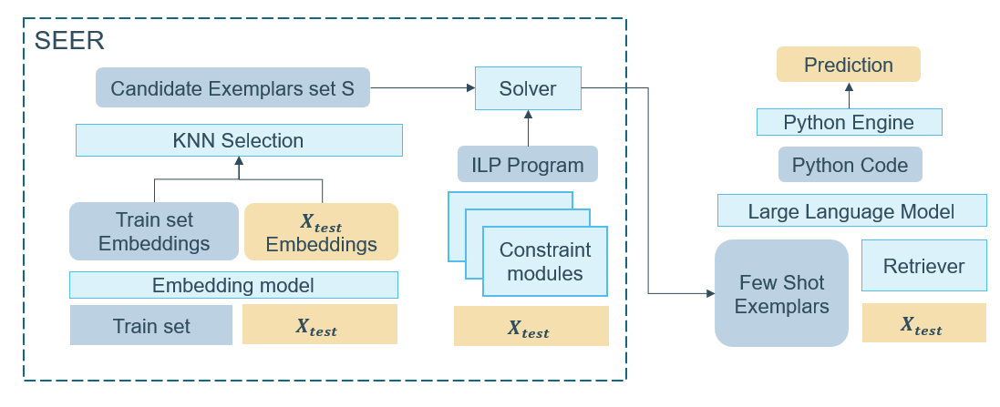

# SEER 🔮

This is the code implementation for the EMNLP 2023 paper "SEER : A Knapsack Approach to Exemplar Selection for In-Context HybridQA".

SEER is a method based on the Knapsack Program to select exemplars for In-Context learning. We evaluate SEER on two HybridQA datasets, FinQA and TAT-QA, with contexts consisting of a structured table and one or more text paragraphs.

<p align="center">
  
</p>


### Requirements

```
$ conda create --name SEER python=3.9
$ conda activate SEER
$ pip install -r requirements.txt
$ python -m spacy download en_core_web_lg
```

### A simple example

Here is an illustration of how to obtain predictions for an instance of the FinQA dataset using SEER for exemplar selection.
The first step is to load the datasets and metadata.

```python
import pandas as pd 
from codex_run import few_shot_prompting, save_result_finqa, save_result_tatqa
from generate_prompt import *
from seer import SEER 
from utils import load_file

#Load the data
finqa_train = load_file('datasets/finqa/train.json')
finqa_test = load_file('datasets/finqa/test.json')
#Load metadata
finqa_train_df = pd.read_csv('data_cache/finqa/metadata/finqa_train_df.csv')
finqa_test_df = pd.read_csv('data_cache/finqa/metadata/finqa_test_df.csv')
text_filter_df = pd.read_csv('data_cache/finqa/text_retriever/retrieved_text_finqa_test.csv')
#The similarity matrices files need to be unzipped before using them
finqa_similarity = pd.read_table('data_cache/finqa/similarity_matrices/finqa_test_sim.txt',header=None,sep=' ') 
#Remove invalid scripts from the train set
valid_idx_finqa = remove_invalid_scripts_finqa(finqa_train)
```

We initialize a SEER object, setting values for the hyperparameters alpha and beta, and deciding on which constraint modules to include.
This assumes that the modality attribute has already been predicted with the constraint modules, and stored in the FinQA test dataframe as 'predicted_modality'.

```python
#Initialize SEER
seer = SEER(alpha=0.75,
            beta=0,
            M=4, #Number of exemplars to select
            modules=['modality'])
```

Retrieve the set of exemplars and assemble a prompt. Predicting the answer given the prompt with CODEX requires an OpenAI API key, which you can obtain by registering an account on the OpenAI website. It further requires to apply for the Researcher Access Program of OpenAI. We also provide functions to use ChatGPT  and GPT-4 as a backbone LLM.

```python            
#Predict instance 0 of the test set
i = 0
#Compute the max prompt size in tokens for the instance
max_code_length=309
max_model_length = 4096
max_length = get_max_prompt_length_finqa(i,finqa_test,text_filter_df,max_code_length,max_model_length)
#Perform the selection
selection = seer.get_few_shot_exemplars(i,finqa_similarity,finqa_train_df,finqa_test_df,valid_idx_finqa,max_length)
#Retrieve the text paragraphs
text_filter = [int(t) for t in text_filter_df.iloc[:,i].dropna().to_list()]
#Assemble the prompt
prompt = get_test_prompt_finqa(finqa_test[i],finqa_train,selection,text_filter)
#Get predictions
result = few_shot_prompting(prompt,key='OPENAI_API_KEY')
save_result_finqa(i,finqa_test,'datasets/finqa/test.json',result,
                "output/finqa/predictions/run1/",selection,print_eval=True)
```

### Citation

```
@article{tonglet2023seer,
  title={SEER: A Knapsack approach to Exemplar Selection for In-Context HybridQA},
  author={Tonglet, Jonathan and Reusens, Manon and Borchert, Philipp and Baesens, Bart},
  journal={arXiv preprint arXiv:2310.06675},
  year={2023}
}
```